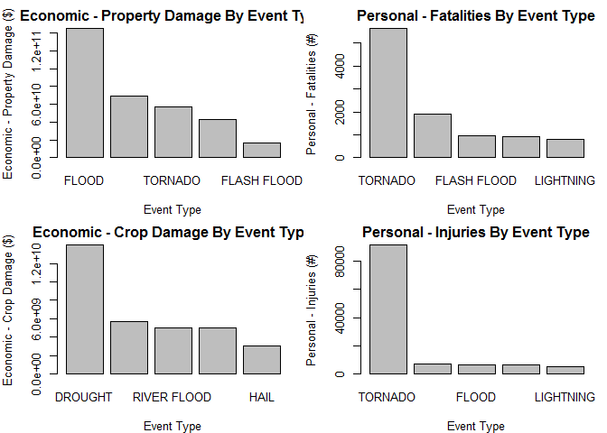

# Data Science - Reproducible Research - Peer Assessment 2
WR  
November 15, 2015  


```r
# Initial Notes 

# Assignment
# 
#   The basic goal of this assignment is to explore the NOAA Storm Database and 
#   answer some basic questions about severe weather events. 

#   You must use the database to answer the questions below and
#   show the code for your entire analysis. 

#   Your analysis can consist of tables, figures, or other summaries. 

#   You may use any R package you want to support your analysis.
# 
# Questions
# 
#   Your data analysis must address the following questions:
# 
#   1.Across the United States, which types of events (as indicated in the EVTYPE variable) 
#   are most harmful with respect to population health?
# 
# 
#   2.Across the United States, which types of events have the greatest 
#   economic consequences?
# 
# 
# Consider writing your report as if it were to be read by a government or 
# municipal manager who might be responsible for preparing for severe weather 
# events and will need to prioritize resources for different types of events. 
# However, there is no need to make any specific recommendations in your report.

# Document Layout

#   -Language: Your document should be written in English.
#   -Title: Your document should have a title that briefly summarizes your data analysis
#   -Synopsis: Immediately after the title, there should be a synopsis which describes 
#     and summarizes your analysis in at most 10 complete sentences.
#   -There should be a section titled Data Processing which describes (in words and code) 
#     how the data were loaded into R and processed for analysis. 
#     In particular, your analysis must start from the raw CSV file containing the data. 
#     You cannot do any preprocessing outside the document. 
#     If preprocessing is time-consuming you may consider using the cache = TRUE option 
#     for certain code chunks.
#   -There should be a section titled Results in which your results are presented.
#   -You may have other sections in your analysis, but 
#     Data Processing and Results are required.
#   -The analysis document must have at least one figure containing a plot.
#   -Your analyis must have no more than three figures. 
#     Figures may have multiple plots in them (i.e. panel plots), but 
#     there cannot be more than three figures total.
#   -You must show all your code for the work in your analysis document. 
#     This may make the document a bit verbose, but that is okay. 
#     In general, you should ensure that echo = TRUE for every code chunk 
#     (this is the default setting in knitr).
```

# Title:  Assessment of NOAA Storm Data and its Impact on Population Health and Economic Consequences 

## Synopsis:  

In this analysis, I look at NOAA Storm Data from 1950 to 2011.  I explore the impact of storms and severe weather and assess their impact on both the health of individuals in the population at large in addition to their impact on the economies of the areas those storms occurred.  Primarily I looked at 2 measures {property damage, crop damage} to assess economic impact and 2 measures {fatalities, injuries} to assess health impact.  An interesting outcome is that the answer varies based on which measure you choose.  Also to note, I interpreted "figure" as being a "plot", else I would have commented out more of my Exploratory Data Analysis.  The plots are at the end of the document in the results section.  

## Data Processing:  

Storm Data is obtained, per the Assignment, from the course website <a href='https://d396qusza40orc.cloudfront.net/repdata%2Fdata%2FStormData.csv.bz2'>here</a>, however per the instructors, the data originated from the NOAA.  

Additional documenation related to this data is also provided, both related to its <a href='https://d396qusza40orc.cloudfront.net/repdata%2Fpeer2_doc%2Fpd01016005curr.pdf'>dataset preparation</a> and a <a href='https://d396qusza40orc.cloudfront.net/repdata%2Fpeer2_doc%2FNCDC%20Storm%20Events-FAQ%20Page.pdf'>FAQ</a>.  

Next, I read in the dataset, and do some exploratory data analysis on the data set. Note, as the Assignment required no more than 3 Plots, the Exploratory Plots are either commented out or removed (with some left here as representative of some of the plots / Exploratory Data Analysis done).    

After reading in the data, the PROPDMGEXP was used to translate the PROPDMG into Actual $ with the result stored in PROPDMGACT.  Similarly, the CROPDMGEXP was used to translate the CROPDMG into Actual $ with the result stored in CROPDMGACT.  These two computed variables, PROPDMGACT and CROPDMGACT, in addition to the two additional original variables, FATALITIES and INJURIES, are used here for analysis.  

Since the Assignment wants to know the the impact of Storms, both in terms of economic impact and personal health, I use the two computed variables, PROPDMGACT and CROPDMGACT, as a proxy to the Economic Damage.  Likewise, I use the two additional original variables, FATALITIES and INJURIES, as a proxy to the impact on Personal Health.  

Next, the Assignment requested the impact to be determined by EVTYPE, and as such, I summarize the weather data into an aggregate dataset where summary statistics{sum, mean, sd, median, min, max} were computed for each variable {PROPDMGACT, CROPDMGACT, FATALITIES, INJURIES}.  

The Data Preprocessing code is as follows:  


```r
# read in data from file 
weatherData.orig <- read.table(
    file = "..\\..\\Data\\repdata_data_StormData.csv.bz2", 
    header = TRUE, sep = ",", na.strings = "NA", nrows = 250000
  )
    #colClasses = c("numeric", "factor", "factor")

# basc summary statistics 
head(weatherData.orig)
```

```
##   STATE__           BGN_DATE BGN_TIME TIME_ZONE COUNTY COUNTYNAME STATE
## 1       1  4/18/1950 0:00:00     0130       CST     97     MOBILE    AL
## 2       1  4/18/1950 0:00:00     0145       CST      3    BALDWIN    AL
## 3       1  2/20/1951 0:00:00     1600       CST     57    FAYETTE    AL
## 4       1   6/8/1951 0:00:00     0900       CST     89    MADISON    AL
## 5       1 11/15/1951 0:00:00     1500       CST     43    CULLMAN    AL
## 6       1 11/15/1951 0:00:00     2000       CST     77 LAUDERDALE    AL
##    EVTYPE BGN_RANGE BGN_AZI BGN_LOCATI END_DATE END_TIME COUNTY_END
## 1 TORNADO         0                                               0
## 2 TORNADO         0                                               0
## 3 TORNADO         0                                               0
## 4 TORNADO         0                                               0
## 5 TORNADO         0                                               0
## 6 TORNADO         0                                               0
##   COUNTYENDN END_RANGE END_AZI END_LOCATI LENGTH WIDTH F MAG FATALITIES
## 1         NA         0                      14.0   100 3   0          0
## 2         NA         0                       2.0   150 2   0          0
## 3         NA         0                       0.1   123 2   0          0
## 4         NA         0                       0.0   100 2   0          0
## 5         NA         0                       0.0   150 2   0          0
## 6         NA         0                       1.5   177 2   0          0
##   INJURIES PROPDMG PROPDMGEXP CROPDMG CROPDMGEXP WFO STATEOFFIC ZONENAMES
## 1       15    25.0          K       0                                    
## 2        0     2.5          K       0                                    
## 3        2    25.0          K       0                                    
## 4        2     2.5          K       0                                    
## 5        2     2.5          K       0                                    
## 6        6     2.5          K       0                                    
##   LATITUDE LONGITUDE LATITUDE_E LONGITUDE_ REMARKS REFNUM
## 1     3040      8812       3051       8806              1
## 2     3042      8755          0          0              2
## 3     3340      8742          0          0              3
## 4     3458      8626          0          0              4
## 5     3412      8642          0          0              5
## 6     3450      8748          0          0              6
```

```r
summary(weatherData.orig)
```

```
##     STATE__                    BGN_DATE         BGN_TIME     
##  Min.   : 1.00   5/18/1995 0:00:00 :   766   1600   :  4981  
##  1st Qu.:19.00   11/11/1995 0:00:00:   572   1700   :  4907  
##  Median :31.00   4/26/1994 0:00:00 :   550   1800   :  4862  
##  Mean   :30.64   4/9/1991 0:00:00  :   542   1500   :  4688  
##  3rd Qu.:44.00   7/4/1995 0:00:00  :   489   1900   :  4248  
##  Max.   :78.00   4/15/1994 0:00:00 :   486   1730   :  4001  
##                  (Other)           :246595   (Other):222313  
##    TIME_ZONE          COUNTY           COUNTYNAME         STATE       
##  CST    :213829   Min.   :  0.0   JEFFERSON :  2761   TX     : 32393  
##  EST    : 20685   1st Qu.: 35.0   JACKSON   :  2319   OK     : 19822  
##  PST    :  7484   Median : 81.0   WASHINGTON:  2307   KS     : 14791  
##  MST    :  5461   Mean   :102.3   FRANKLIN  :  1891   MO     :  9846  
##  AST    :   928   3rd Qu.:135.0   LINCOLN   :  1851   NE     :  9316  
##  CDT    :   692   Max.   :840.0   MADISON   :  1727   AR     :  8901  
##  (Other):   921                   (Other)   :237144   (Other):154931  
##                 EVTYPE        BGN_RANGE           BGN_AZI      
##  TSTM WIND         :91668   Min.   :   0.000          :234864  
##  HAIL              :81195   1st Qu.:   0.000   N      :  2604  
##  TORNADO           :37544   Median :   0.000   S      :  2547  
##  THUNDERSTORM WINDS:20843   Mean   :   0.369   W      :  2326  
##  FLASH FLOOD       : 3356   3rd Qu.:   0.000   E      :  1982  
##  LIGHTNING         : 2603   Max.   :3749.000   SW     :  1294  
##  (Other)           :12791                      (Other):  4383  
##       BGN_LOCATI                   END_DATE             END_TIME     
##            :197904                     :243411              :238978  
##  Countywide:   993   12/29/1993 0:00:00:    58   1600EST    :   191  
##  Amarillo  :    99   3/18/1996 0:00:00 :    56   11:59:00 PM:   174  
##  Clinton   :    85   3/6/1996 0:00:00  :    54   2000EST    :   157  
##  Columbia  :    83   3/14/1993 0:00:00 :    45   1200EST    :   150  
##  Jackson   :    81   5/18/1995 0:00:00 :    44   1500EST    :   147  
##  (Other)   : 50755   (Other)           :  6332   (Other)    : 10203  
##    COUNTY_END COUNTYENDN       END_RANGE           END_AZI      
##  Min.   :0    Mode:logical   Min.   :  0.0000          :248785  
##  1st Qu.:0    NA's:250000    1st Qu.:  0.0000   N      :   158  
##  Median :0                   Median :  0.0000   E      :   157  
##  Mean   :0                   Mean   :  0.0619   S      :   148  
##  3rd Qu.:0                   3rd Qu.:  0.0000   NE     :   133  
##  Max.   :0                   Max.   :925.0000   W      :   129  
##                                                 (Other):   490  
##         END_LOCATI         LENGTH              WIDTH        
##              :246174   Min.   :   0.0000   Min.   :   0.00  
##  TPA         :    64   1st Qu.:   0.0000   1st Qu.:   0.00  
##  Countywide  :    44   Median :   0.0000   Median :   0.00  
##  TUCSON      :    40   Mean   :   0.5663   Mean   :  14.99  
##  GNV         :    31   3rd Qu.:   0.0000   3rd Qu.:   0.00  
##  (OK Mesonet):    28   Max.   :2315.0000   Max.   :3330.00  
##  (Other)     :  3619                                        
##        F               MAG           FATALITIES          INJURIES       
##  Min.   :0.00     Min.   :  0.00   Min.   :  0.0000   Min.   :   0.000  
##  1st Qu.:0.00     1st Qu.:  0.00   1st Qu.:  0.0000   1st Qu.:   0.000  
##  Median :1.00     Median :  0.00   Median :  0.0000   Median :   0.000  
##  Mean   :1.13     Mean   : 51.07   Mean   :  0.0257   Mean   :   0.331  
##  3rd Qu.:2.00     3rd Qu.: 75.00   3rd Qu.:  0.0000   3rd Qu.:   0.000  
##  Max.   :5.00     Max.   :999.00   Max.   :583.0000   Max.   :1700.000  
##  NA's   :214380                                                         
##     PROPDMG         PROPDMGEXP        CROPDMG           CROPDMGEXP    
##  Min.   :  0.00          :190358   Min.   :  0.0000          :246178  
##  1st Qu.:  0.00   K      : 55343   1st Qu.:  0.0000   K      :  3544  
##  Median :  0.00   M      :  3964   Median :  0.0000   M      :   224  
##  Mean   : 13.06   0      :   215   Mean   :  0.7098   k      :    21  
##  3rd Qu.:  0.00   5      :    28   3rd Qu.:  0.0000   0      :    19  
##  Max.   :900.00   1      :    25   Max.   :750.0000   ?      :     7  
##                   (Other):    67                      (Other):     7  
##       WFO                      STATEOFFIC    
##         :142069                     :248767  
##  AT     : 12212   ALABAMA, Central  :   491  
##  ATA    :  9589   ALASKA, Southern  :   181  
##  T      :  7166   ALABAMA, Southwest:   128  
##  OKC    :  5359   ARIZONA, Southwest:   120  
##  NG     :  5276   ARIZONA, South    :    92  
##  (Other): 68329   (Other)           :   221  
##                                                            ZONENAMES     
##                                                                 :244818  
##  EASTERN BARANOF ISLAND AND SOU - EASTERN BARANOF ISLAND AND SOU:   146  
##  SAN JUAN AND VICINITY - SAN JUAN AND VICINITY                  :    58  
##  HOUSTON - HOUSTON                                              :    57  
##  NORTH CENTRAL - NORTH CENTRAL                                  :    48  
##  SALISBURY SOUND TO CAPE FAIRWE - SALISBURY SOUND TO CAPE FAIRWE:    43  
##  (Other)                                                        :  4830  
##     LATITUDE      LONGITUDE       LATITUDE_E       LONGITUDE_     
##  Min.   :   0   Min.   :    0   Min.   :   0.0   Min.   :    0.0  
##  1st Qu.:2754   1st Qu.: 7309   1st Qu.:   0.0   1st Qu.:    0.0  
##  Median :3500   Median : 8836   Median :   0.0   Median :    0.0  
##  Mean   :2840   Mean   : 6973   Mean   : 184.1   Mean   :  454.9  
##  3rd Qu.:4008   3rd Qu.: 9646   3rd Qu.:   0.0   3rd Qu.:    0.0  
##  Max.   :5273   Max.   :15941   Max.   :4902.0   Max.   :12256.0  
##                                                                   
##                                           REMARKS           REFNUM      
##                                               :187668   Min.   :     1  
##                                               : 24010   1st Qu.: 62501  
##  Several trees were blown down.               :   256   Median :125001  
##                                               :   191   Mean   :125001  
##  Trees were downed.                           :   136   3rd Qu.:187500  
##  Trees were blown down by thunderstorm winds. :   118   Max.   :250058  
##  (Other)                                      : 37621
```

```r
dim(weatherData.orig)
```

```
## [1] 250000     37
```

```r
# focus on impact to population and economy - identify the variables and provide basic statistcs 
quantile(weatherData.orig$FATALITIES)
```

```
##   0%  25%  50%  75% 100% 
##    0    0    0    0  583
```

```r
quantile(weatherData.orig$INJURIES)
```

```
##   0%  25%  50%  75% 100% 
##    0    0    0    0 1700
```

```r
quantile(weatherData.orig$PROPDMG)
```

```
##   0%  25%  50%  75% 100% 
##    0    0    0    0  900
```

```r
quantile(weatherData.orig$CROPDMG)
```

```
##   0%  25%  50%  75% 100% 
##    0    0    0    0  750
```

```r
unique(weatherData.orig$EVTYPE)
```

```
##   [1] TORNADO                        TSTM WIND                     
##   [3] HAIL                           FREEZING RAIN                 
##   [5] SNOW                           ICE STORM/FLASH FLOOD         
##   [7] SNOW/ICE                       WINTER STORM                  
##   [9] HURRICANE OPAL/HIGH WINDS      THUNDERSTORM WINDS            
##  [11] RECORD COLD                    HURRICANE ERIN                
##  [13] HURRICANE OPAL                 HEAVY RAIN                    
##  [15] LIGHTNING                      THUNDERSTORM WIND             
##  [17] DENSE FOG                      RIP CURRENT                   
##  [19] THUNDERSTORM WINS              FLASH FLOOD                   
##  [21] FLASH FLOODING                 HIGH WINDS                    
##  [23] FUNNEL CLOUD                   TORNADO F0                    
##  [25] THUNDERSTORM WINDS LIGHTNING   THUNDERSTORM WINDS/HAIL       
##  [27] HEAT                           WIND                          
##  [29] LIGHTING                       HEAVY RAINS                   
##  [31] LIGHTNING AND HEAVY RAIN       FUNNEL                        
##  [33] WALL CLOUD                     FLOODING                      
##  [35] THUNDERSTORM WINDS HAIL        FLOOD                         
##  [37] COLD                           HEAVY RAIN/LIGHTNING          
##  [39] FLASH FLOODING/THUNDERSTORM WI WALL CLOUD/FUNNEL CLOUD       
##  [41] THUNDERSTORM                   WATERSPOUT                    
##  [43] EXTREME COLD                   HAIL 1.75)                    
##  [45] LIGHTNING/HEAVY RAIN           HIGH WIND                     
##  [47] BLIZZARD                       BLIZZARD WEATHER              
##  [49] WIND CHILL                     BREAKUP FLOODING              
##  [51] HIGH WIND/BLIZZARD             RIVER FLOOD                   
##  [53] HEAVY SNOW                     FREEZE                        
##  [55] COASTAL FLOOD                  HIGH WIND AND HIGH TIDES      
##  [57] HIGH WIND/BLIZZARD/FREEZING RA HIGH TIDES                    
##  [59] HIGH WIND AND HEAVY SNOW       RECORD COLD AND HIGH WIND     
##  [61] RECORD HIGH TEMPERATURE        RECORD HIGH                   
##  [63] HIGH WINDS HEAVY RAINS         HIGH WIND/ BLIZZARD           
##  [65] ICE STORM                      BLIZZARD/HIGH WIND            
##  [67] HIGH WIND/LOW WIND CHILL       HEAVY SNOW/HIGH               
##  [69] RECORD LOW                     HIGH WINDS AND WIND CHILL     
##  [71] HEAVY SNOW/HIGH WINDS/FREEZING LOW TEMPERATURE RECORD        
##  [73] AVALANCHE                      MARINE MISHAP                 
##  [75] WIND CHILL/HIGH WIND           HIGH WIND/WIND CHILL/BLIZZARD 
##  [77] HIGH WIND/WIND CHILL           HIGH WIND/HEAVY SNOW          
##  [79] HIGH TEMPERATURE RECORD        FLOOD WATCH/                  
##  [81] RECORD HIGH TEMPERATURES       HIGH WIND/SEAS                
##  [83] HIGH WINDS/HEAVY RAIN          HIGH SEAS                     
##  [85] SEVERE TURBULENCE              RECORD RAINFALL               
##  [87] RECORD SNOWFALL                RECORD WARMTH                 
##  [89] HEAVY SNOW/WIND                EXTREME HEAT                  
##  [91] WIND DAMAGE                    DUST STORM                    
##  [93] APACHE COUNTY                  SLEET                         
##  [95] HAIL STORM                     FUNNEL CLOUDS                 
##  [97] FLASH FLOODS                   DUST DEVIL                    
##  [99] EXCESSIVE HEAT                 THUNDERSTORM WINDS/FUNNEL CLOU
## [101] WINTER STORM/HIGH WIND         WINTER STORM/HIGH WINDS       
## [103] GUSTY WINDS                    STRONG WINDS                  
## [105] FLOODING/HEAVY RAIN            SNOW AND WIND                 
## [107] HEAVY SURF COASTAL FLOODING    HEAVY SURF                    
## [109] HEAVY PRECIPATATION            URBAN FLOODING                
## [111] HIGH SURF                      BLOWING DUST                  
## [113] URBAN/SMALL                    WILD FIRES                    
## [115] HIGH                           URBAN/SMALL FLOODING          
## [117] WATER SPOUT                    HIGH WINDS DUST STORM         
## [119] WINTER STORM HIGH WINDS        LOCAL FLOOD                   
## [121] WINTER STORMS                  MUDSLIDES                     
## [123] RAINSTORM                      SEVERE THUNDERSTORM           
## [125] SEVERE THUNDERSTORMS           SEVERE THUNDERSTORM WINDS     
## [127] THUNDERSTORMS WINDS            DRY MICROBURST                
## [129] FLOOD/FLASH FLOOD              FLOOD/RAIN/WINDS              
## [131] WINDS                          DRY MICROBURST 61             
## [133] THUNDERSTORMS                  FLASH FLOOD WINDS             
## [135] URBAN/SMALL STREAM FLOODING    MICROBURST                    
## [137] STRONG WIND                    HIGH WIND DAMAGE              
## [139] STREAM FLOODING                URBAN AND SMALL               
## [141] HEAVY SNOWPACK                 ICE                           
## [143] FLASH FLOOD/                   DOWNBURST                     
## [145] GUSTNADO AND                   FLOOD/RAIN/WIND               
## [147] WET MICROBURST                 DOWNBURST WINDS               
## [149] DRY MICROBURST WINDS           DRY MIRCOBURST WINDS          
## [151] DRY MICROBURST 53              SMALL STREAM URBAN FLOOD      
## [153] MICROBURST WINDS               HIGH WINDS 57                 
## [155] DRY MICROBURST 50              HIGH WINDS 66                 
## [157] HIGH WINDS 76                  HIGH WINDS 63                 
## [159] HIGH WINDS 67                  BLIZZARD/HEAVY SNOW           
## [161] HEAVY SNOW/HIGH WINDS          BLOWING SNOW                  
## [163] HIGH WINDS 82                  HIGH WINDS 80                 
## [165] HIGH WINDS 58                  FREEZING DRIZZLE              
## [167] LIGHTNING THUNDERSTORM WINDSS  DRY MICROBURST 58             
## [169] HAIL 75                        HIGH WINDS 73                 
## [171] HIGH WINDS 55                  LIGHT SNOW AND SLEET          
## [173] URBAN FLOOD                    DRY MICROBURST 84             
## [175] THUNDERSTORM WINDS 60          HEAVY RAIN/FLOODING           
## [177] THUNDERSTORM WINDSS            TORNADOS                      
## [179] GLAZE                          RECORD HEAT                   
## [181] COASTAL FLOODING               HEAT WAVE                     
## [183] FIRST SNOW                     FREEZING RAIN AND SLEET       
## [185] UNSEASONABLY DRY               UNSEASONABLY WET              
## [187] WINTRY MIX                     WINTER WEATHER                
## [189] UNSEASONABLY COLD              EXTREME/RECORD COLD           
## [191] RIP CURRENTS HEAVY SURF        SLEET/RAIN/SNOW               
## [193] UNSEASONABLY WARM              DROUGHT                       
## [195] NORMAL PRECIPITATION           HIGH WINDS/FLOODING           
## [197] DRY                            RAIN/SNOW                     
## [199] SNOW/RAIN/SLEET                WATERSPOUT/TORNADO            
## [201] WATERSPOUTS                    WATERSPOUT TORNADO            
## [203] URBAN/SMALL STREAM FLOOD       STORM SURGE                   
## [205] WATERSPOUT-TORNADO             WATERSPOUT-                   
## [207] TORNADOES, TSTM WIND, HAIL     TROPICAL STORM ALBERTO        
## [209] TROPICAL STORM                 TROPICAL STORM GORDON         
## [211] TROPICAL STORM JERRY           LIGHTNING THUNDERSTORM WINDS  
## [213] WAYTERSPOUT                    MINOR FLOODING                
## [215] LIGHTNING INJURY               URBAN/SMALL STREAM  FLOOD     
## [217] LIGHTNING AND THUNDERSTORM WIN THUNDERSTORM WINDS53          
## [219] URBAN AND SMALL STREAM FLOOD   URBAN AND SMALL STREAM        
## [221] WILDFIRE                       DAMAGING FREEZE               
## [223] THUNDERSTORM WINDS 13          SMALL HAIL                    
## [225] HEAVY SNOW/HIGH WIND           HURRICANE                     
## [227] WILD/FOREST FIRE               SMALL STREAM FLOODING         
## [229] MUD SLIDE                      LIGNTNING                     
## [231] FROST                          FREEZING RAIN/SNOW            
## [233] HIGH WINDS/                    THUNDERSNOW                   
## [235] FLOODS                         EXTREME WIND CHILLS           
## [237] COOL AND WET                   HEAVY RAIN/SNOW               
## [239] SMALL STREAM AND URBAN FLOODIN SMALL STREAM/URBAN FLOOD      
## [241] SNOW/SLEET/FREEZING RAIN       SEVERE COLD                   
## [243] GLAZE ICE                      COLD WAVE                     
## [245] EARLY SNOW                     SMALL STREAM AND URBAN FLOOD  
## [247] HIGH  WINDS                    RURAL FLOOD                   
## [249] SMALL STREAM AND               MUD SLIDES                    
## [251] HAIL 80                        EXTREME WIND CHILL            
## [253] COLD AND WET CONDITIONS        EXCESSIVE WETNESS             
## [255] GRADIENT WINDS                 HEAVY SNOW/BLOWING SNOW       
## [257] SLEET/ICE STORM                THUNDERSTORM WINDS URBAN FLOOD
## [259] THUNDERSTORM WINDS SMALL STREA ROTATING WALL CLOUD           
## [261] LARGE WALL CLOUD               COLD AIR FUNNEL               
## [263] GUSTNADO                       COLD AIR FUNNELS              
## [265] BLOWING SNOW- EXTREME WIND CHI SNOW AND HEAVY SNOW           
## [267] GROUND BLIZZARD                MAJOR FLOOD                   
## [269] SNOW/HEAVY SNOW                FREEZING RAIN/SLEET           
## [271] ICE JAM FLOODING               SNOW- HIGH WIND- WIND CHILL   
## [273] STREET FLOOD                   COLD AIR TORNADO              
## [275] SMALL STREAM FLOOD             FOG                           
## [277] THUNDERSTORM WINDS 2           FUNNEL CLOUD/HAIL             
## [279] ICE/SNOW                       TSTM WIND 51                  
## [281] TSTM WIND 50                   TSTM WIND 52                  
## [283] TSTM WIND 55                   HEAVY SNOW/BLIZZARD           
## [285] THUNDERSTORM WINDS 61          HAIL 0.75                     
## [287] THUNDERSTORM DAMAGE            THUNDERTORM WINDS             
## [289] HAIL 1.00                      HAIL/WINDS                    
## [291] SNOW AND ICE                   WIND STORM                    
## [293] SNOWSTORM                      GRASS FIRES                   
## [295] LAKE FLOOD                     PROLONG COLD                  
## [297] HAIL/WIND                      HAIL 1.75                     
## [299] THUNDERSTORMW 50               WIND/HAIL                     
## [301] SNOW AND ICE STORM             URBAN AND SMALL STREAM FLOODIN
## [303] THUNDERSTORMS WIND             THUNDERSTORM  WINDS           
## [305] HEAVY SNOW/SLEET               AGRICULTURAL FREEZE           
## [307] DROUGHT/EXCESSIVE HEAT         TUNDERSTORM WIND              
## [309] TROPICAL STORM DEAN            THUNDERTSORM WIND             
## [311] THUNDERSTORM WINDS/ HAIL       THUNDERSTORM WIND/LIGHTNING   
## [313] HEAVY RAIN/SEVERE WEATHER      THUNDESTORM WINDS             
## [315] WATERSPOUT/ TORNADO            LIGHTNING.                    
## [317] WARM DRY CONDITIONS            HURRICANE-GENERATED SWELLS    
## [319] HEAVY SNOW/ICE STORM           RIVER AND STREAM FLOOD        
## [321] HIGH WIND 63                   COASTAL SURGE                 
## [323] HEAVY SNOW AND ICE STORM       MINOR FLOOD                   
## [325] HIGH WINDS/COASTAL FLOOD       RAIN                          
## [327] RIVER FLOODING                 SNOW/RAIN                     
## [329] ICE FLOES                      HIGH WAVES                    
## [331] SNOW SQUALLS                   SNOW SQUALL                   
## [333] THUNDERSTORM WIND G50          LIGHTNING FIRE                
## [335] BLIZZARD/FREEZING RAIN         HEAVY LAKE SNOW               
## [337] HEAVY SNOW/FREEZING RAIN       LAKE EFFECT SNOW              
## [339] HEAVY WET SNOW                 DUST DEVIL WATERSPOUT         
## [341] THUNDERSTORM WINDS/HEAVY RAIN  THUNDERSTROM WINDS            
## [343] THUNDERSTORM WINDS      LE CEN HAIL 225                      
## [345] BLIZZARD AND HEAVY SNOW        HEAVY SNOW AND ICE            
## [347] ICE STORM AND SNOW             HEAVY SNOW ANDBLOWING SNOW    
## [349] HEAVY SNOW/ICE                 BLIZZARD AND EXTREME WIND CHIL
## [351] LOW WIND CHILL                 BLOWING SNOW & EXTREME WIND CH
## [353] WATERSPOUT/                    URBAN/SMALL STREAM            
## [355] TORNADO F3                     FUNNEL CLOUD.                 
## [357] TORNDAO                        HAIL 0.88                     
## [359] FLOOD/RIVER FLOOD              MUD SLIDES URBAN FLOODING     
## [361] TORNADO F1                     THUNDERSTORM WINDS G          
## [363] DEEP HAIL                      GLAZE/ICE STORM               
## [365] HEAVY SNOW/WINTER STORM        AVALANCE                      
## [367] BLIZZARD/WINTER STORM          DUST STORM/HIGH WINDS         
## [369] ICE JAM                        FOREST FIRES                  
## [371] THUNDERSTORM WIND G60          FROST\\FREEZE                 
## [373] THUNDERSTORM WINDS.            HAIL 88                       
## [375] HAIL 175                       HVY RAIN                      
## [377] HAIL 100                       HAIL 150                      
## [379] HAIL 075                       THUNDERSTORM WIND G55         
## [381] HAIL 125                       THUNDERSTORM WINDS G60        
## [383] HARD FREEZE                    HAIL 200                      
## [385] THUNDERSTORM WINDS FUNNEL CLOU THUNDERSTORM WINDS 62         
## [387] WILDFIRES                      RECORD HEAT WAVE              
## [389] HEAVY SNOW AND HIGH WINDS      HEAVY SNOW/HIGH WINDS & FLOOD 
## [391] HAIL FLOODING                  THUNDERSTORM WINDS/FLASH FLOOD
## [393] HIGH WIND 70                   WET SNOW                      
## [395] HEAVY RAIN AND FLOOD           LOCAL FLASH FLOOD             
## [397] THUNDERSTORM WINDS 53          FLOOD/FLASH FLOODING          
## [399] TORNADO/WATERSPOUT             RAIN AND WIND                 
## [401] THUNDERSTORM WIND 59           THUNDERSTORM WIND 52          
## [403] COASTAL/TIDAL FLOOD            SNOW/ICE STORM                
## [405] BELOW NORMAL PRECIPITATION     RIP CURRENTS/HEAVY SURF       
## [407] FLASH FLOOD/FLOOD              EXCESSIVE RAIN                
## [409] RECORD/EXCESSIVE HEAT          HEAT WAVES                    
## [411] LIGHT SNOW                     THUNDERSTORM WIND 69          
## [413] HAIL DAMAGE                    LIGHTNING DAMAGE              
## [415] RECORD TEMPERATURES            LIGHTNING AND WINDS           
## [417] FOG AND COLD TEMPERATURES      OTHER                         
## [419] RECORD SNOW                    SNOW/COLD                     
## [421] FLASH FLOOD FROM ICE JAMS      TSTM WIND G58                 
## [423] MUDSLIDE                       HEAVY SNOW SQUALLS            
## [425] HEAVY SNOW/SQUALLS             HEAVY SNOW-SQUALLS            
## [427] ICY ROADS                      HEAVY MIX                     
## [429] SNOW FREEZING RAIN             LACK OF SNOW                  
## [431] SNOW/SLEET                     SNOW/FREEZING RAIN            
## [433] SNOW DROUGHT                   THUNDERSTORMW WINDS           
## [435] THUNDERSTORM WIND 60 MPH       THUNDERSTORM WIND 65MPH       
## [437] THUNDERSTORM WIND/ TREES       THUNDERSTORM WIND/AWNING      
## [439] THUNDERSTORM WIND 98 MPH       THUNDERSTORM WIND TREES       
## [441] TORRENTIAL RAIN                TORNADO F2                    
## [443] RIP CURRENTS                   HURRICANE EMILY               
## [445] HURRICANE GORDON               HURRICANE FELIX               
## [447] THUNDERSTORM WIND 59 MPH       THUNDERSTORM WINDS 63 MPH     
## [449] THUNDERSTORM WIND/ TREE        THUNDERSTORM DAMAGE TO        
## [451] THUNDERSTORM WIND 65 MPH       FLASH FLOOD - HEAVY RAIN      
## [453] THUNDERSTORM WIND.             FLASH FLOOD/ STREET           
## [455] THUNDERSTORM WIND 59 MPH.      HEAVY SNOW   FREEZING RAIN    
## [457] DAM FAILURE                    THUNDERSTORM HAIL             
## [459] HAIL 088                       THUNDERSTORM WINDSHAIL        
## [461] LIGHTNING  WAUSEON             THUDERSTORM WINDS             
## [463] ICE AND SNOW                   RECORD COLD/FROST             
## [465] STORM FORCE WINDS              FREEZING RAIN AND SNOW        
## [467] FREEZING RAIN SLEET AND        SOUTHEAST                     
## [469] HEAVY SNOW & ICE               FREEZING DRIZZLE AND FREEZING 
## [471] THUNDERSTORM WINDS AND         HAIL/ICY ROADS                
## [473] FLASH FLOOD/HEAVY RAIN         HEAVY RAIN; URBAN FLOOD WINDS;
## [475] HEAVY PRECIPITATION            TSTM WIND DAMAGE              
## [477] HIGH WATER                     FLOOD FLASH                   
## [479] RAIN/WIND                      THUNDERSTORM WINDS 50         
## [481] THUNDERSTORM WIND G52          FLOOD FLOOD/FLASH             
## [483] THUNDERSTORM WINDS 52          SNOW SHOWERS                  
## [485] THUNDERSTORM WIND G51          HEAT WAVE DROUGHT             
## [487] HEAVY SNOW/BLIZZARD/AVALANCHE  RECORD SNOW/COLD              
## [489] WET WEATHER                    UNSEASONABLY WARM AND DRY     
## [491] FREEZING RAIN SLEET AND LIGHT  RECORD/EXCESSIVE RAINFALL     
## [493] TIDAL FLOOD                    BEACH EROSIN                  
## [495] THUNDERSTORM WIND G61          FLOOD/FLASH                   
## [497] LOW TEMPERATURE                SLEET & FREEZING RAIN         
## [499] HEAVY RAINS/FLOODING           THUNDERESTORM WINDS           
## [501] THUNDERSTORM WINDS/FLOODING    THUNDEERSTORM WINDS           
## [503] HIGHWAY FLOODING               THUNDERSTORM W INDS           
## [505] HYPOTHERMIA                    FLASH FLOOD/ FLOOD            
## [507] THUNDERSTORM WIND 50           THUNERSTORM WINDS             
## [509] HEAVY RAIN/MUDSLIDES/FLOOD     MUD/ROCK SLIDE                
## [511] HIGH WINDS/COLD                BEACH EROSION/COASTAL FLOOD   
## [513] COLD/WINDS                     SNOW/ BITTER COLD             
## [515] THUNDERSTORM WIND 56           SNOW SLEET                    
## [517] DRY HOT WEATHER                COLD WEATHER                  
## [519] RAPIDLY RISING WATER           HAIL ALOFT                    
## [521] EARLY FREEZE                   ICE/STRONG WINDS              
## [523] EXTREME WIND CHILL/BLOWING SNO SNOW/HIGH WINDS               
## [525] HIGH WINDS/SNOW                EARLY FROST                   
## [527] SNOWMELT FLOODING              HEAVY SNOW AND STRONG WINDS   
## [529] SNOW ACCUMULATION              BLOWING SNOW/EXTREME WIND CHIL
## [531] SNOW/ ICE                      SNOW/BLOWING SNOW             
## [533] TORNADOES                      THUNDERSTORM WIND/HAIL        
## [535] FLASH FLOODING/FLOOD           HAIL 275                      
## [537] HAIL 450                       FLASH FLOOODING               
## [539] EXCESSIVE RAINFALL             THUNDERSTORMW                 
## [541] HAILSTORM                      TSTM WINDS                    
## [543] BEACH FLOOD                    HAILSTORMS                    
## [545] TSTMW                          FUNNELS                       
## [547] TSTM WIND 65)                  THUNDERSTORM WINDS/ FLOOD     
## [549] HEAVY RAINFALL                 HEAT/DROUGHT                  
## [551] HEAT DROUGHT                   NEAR RECORD SNOW              
## [553] LANDSLIDE                      HIGH WIND AND SEAS            
## [555] THUNDERSTORMWINDS              THUNDERSTORM WINDS HEAVY RAIN 
## [557] SLEET/SNOW                     EXCESSIVE                     
## [559] SNOW/SLEET/RAIN                WILD/FOREST FIRES             
## [561] HEAVY SEAS                     DUSTSTORM                     
## [563] FLOOD & HEAVY RAIN             ?                             
## [565] THUNDERSTROM WIND              FLOOD/FLASHFLOOD              
## [567] SNOW AND COLD                  HOT PATTERN                   
## [569] PROLONG COLD/SNOW              BRUSH FIRES                   
## [571] SNOW\\COLD                     WINTER MIX                    
## [573] EXCESSIVE PRECIPITATION        SNOWFALL RECORD               
## [575] HOT/DRY PATTERN                DRY PATTERN                   
## [577] MILD/DRY PATTERN               MILD PATTERN                  
## [579] LANDSLIDES                     HEAVY SHOWERS                 
## [581] HEAVY SNOW AND                 HIGH WIND 48                  
## [583] LAKE-EFFECT SNOW               BRUSH FIRE                    
## [585] WATERSPOUT FUNNEL CLOUD        URBAN SMALL STREAM FLOOD      
## [587] SAHARAN DUST                   HEAVY SHOWER                  
## [589] URBAN FLOOD LANDSLIDE          HEAVY SWELLS                  
## [591] URBAN SMALL                    URBAN FLOODS                  
## [593] SMALL STREAM                   HEAVY RAIN/URBAN FLOOD        
## [595] FLASH FLOOD/LANDSLIDE          LANDSLIDE/URBAN FLOOD         
## [597] HEAVY RAIN/SMALL STREAM URBAN  FLASH FLOOD LANDSLIDES        
## [599] EXTREME WINDCHILL              URBAN/SML STREAM FLD          
## [601] TSTM WIND/HAIL                 Other                         
## [603] Record dry month               Temperature record            
## [605] Minor Flooding                 Ice jam flood (minor          
## [607] High Wind                      Tstm Wind                     
## 608 Levels: ? AGRICULTURAL FREEZE APACHE COUNTY AVALANCE ... WINTRY MIX
```

```r
unique(weatherData.orig$PROPDMGEXP)
```

```
##  [1] K M   B m + 0 5 6 ? 4 2 3 h 7 H - 1 8
## Levels:  - ? + 0 1 2 3 4 5 6 7 8 B h H K m M
```

```r
unique(weatherData.orig$CROPDMGEXP)
```

```
## [1]   M K m B ? 0 k 2
## Levels:  ? 0 2 B k K m M
```

```r
# 
# hist(
#   weatherData.orig$FATALITIES, col = "red", 
#      main = "Fatalities Per Storm Event",
#      xlab = "Fatalities (#)",
#      ylab = "Frequency"
# )
# hist(
#   weatherData.orig$INJURIES, col = "red", 
#      main = "Injuries Per Storm Event",
#      xlab = "Injuries (#)",
#      ylab = "Frequency"
# )
# hist(
#   weatherData.orig$PROPDMG, col = "red", 
#      main = "Property Damage Per Storm Event",
#      xlab = "Property Damage ($)",
#      ylab = "Frequency"
# )
# hist(
#   weatherData.orig$CROPDMG, col = "red", 
#      main = "Crop Damage Per Storm Event",
#      xlab = "Crop Damage ($)",
#      ylab = "Frequency"
# )
# 
# # plot4 - here placed Row 1, Column 2 
# plot(
#   x = weatherData.orig$BGN_DATE, 
#   y = weatherData.orig$FATALITIES, 
#   type = "l",
#   main ="Fatalities Per Storm Event Over Time", 
#   xlab = "Day", 
#   ylab = "Fatalities (#)"
# )
# 
# # plot4 - here placed Row 1, Column 2 
# plot(
#   x = weatherData.orig$BGN_DATE, 
#   y = weatherData.orig$INJURIES, 
#   type = "l",
#   main ="Injuries Per Storm Event Over Time", 
#   xlab = "Day", 
#   ylab = "Injuries (#)"
# )
# 
# 
# # plot4 - here placed Row 1, Column 2 
# plot(
#   x = weatherData.orig$BGN_DATE, 
#   y = weatherData.orig$PROPDMG, 
#   type = "l",
#   main ="Property Damage Per Storm Event Over Time", 
#   xlab = "Day", 
#   ylab = "Property Damage ($)"
# )
# 
# 
# 
# # plot4 - here placed Row 1, Column 2 
# plot(
#   x = weatherData.orig$BGN_DATE, 
#   y = weatherData.orig$CROPDMG, 
#   type = "l",
#   main ="Crop Damage Per Storm Event Over Time", 
#   xlab = "Day", 
#   ylab = "Crop Damage ($)"
# )

library(dplyr)
```

```
## 
## Attaching package: 'dplyr'
## 
## The following objects are masked from 'package:stats':
## 
##     filter, lag
## 
## The following objects are masked from 'package:base':
## 
##     intersect, setdiff, setequal, union
```

```r
# 
# weatherData.orig <- cbind(weatherData.orig, PROPDMGACT = weatherData.orig$PROPDMG * if(weatherData.orig$PROPDMGEXP == "B") {1000 * 1000 * 1000} else if(weatherData.orig$PROPDMGEXP == "M") {1000 * 1000} else if(weatherData.orig$PROPDMGEXP == "K") {1000} else {1})


# filter for "B" and get subset 
weatherData.PROP.B <- weatherData.orig %>% 
  select(everything()) %>% 
  filter(PROPDMGEXP %in% c("B")) 
  
# filter for "M" and get subset 
weatherData.PROP.M <- weatherData.orig %>% 
  select(everything()) %>% 
  filter(PROPDMGEXP %in% c("M")) 
  
# filter for "M" and get subset 
weatherData.PROP.K <- weatherData.orig %>% 
  select(everything()) %>% 
  filter(PROPDMGEXP %in% c("K")) 
  
# filter for "M" and get subset 
weatherData.PROP.N <- weatherData.orig %>% 
  select(everything()) %>% 
  filter(!(PROPDMGEXP %in% c("B", "M", "K"))) 
  
# add Property Damage in Actual $ to the respective datasets 
weatherData.PROP.B <- cbind(weatherData.PROP.B, PROPDMGACT = weatherData.PROP.B$PROPDMG * (1000 * 1000 * 1000))
weatherData.PROP.M <- cbind(weatherData.PROP.M, PROPDMGACT = weatherData.PROP.M$PROPDMG * (1000 * 1000))
weatherData.PROP.K <- cbind(weatherData.PROP.K, PROPDMGACT = weatherData.PROP.K$PROPDMG * (1000))
weatherData.PROP.N <- cbind(weatherData.PROP.N, PROPDMGACT = weatherData.PROP.N$PROPDMG * (1))

# resssemble dataset 
weatherData.INTERIM <- rbind(weatherData.PROP.B, weatherData.PROP.M, weatherData.PROP.K, weatherData.PROP.N) 

# filter for "B" and get subset 
weatherData.CROP.B <- weatherData.INTERIM %>% 
  select(everything()) %>% 
  filter(CROPDMGEXP %in% c("B")) 
  
# filter for "M" and get subset 
weatherData.CROP.M <- weatherData.INTERIM %>% 
  select(everything()) %>% 
  filter(CROPDMGEXP %in% c("M")) 
  
# filter for "M" and get subset 
weatherData.CROP.K <- weatherData.INTERIM %>% 
  select(everything()) %>% 
  filter(CROPDMGEXP %in% c("K")) 
  
# filter for "M" and get subset 
weatherData.CROP.N <- weatherData.INTERIM %>% 
  select(everything()) %>% 
  filter(!(CROPDMGEXP %in% c("B", "M", "K"))) 

# add CROP Damage in Actual $ to the respective datasets 
weatherData.CROP.B <- cbind(weatherData.CROP.B, CROPDMGACT = weatherData.CROP.B$CROPDMG * (1000 * 1000 * 1000))
weatherData.CROP.M <- cbind(weatherData.CROP.M, CROPDMGACT = weatherData.CROP.M$CROPDMG * (1000 * 1000))
weatherData.CROP.K <- cbind(weatherData.CROP.K, CROPDMGACT = weatherData.CROP.K$CROPDMG * (1000))
weatherData.CROP.N <- cbind(weatherData.CROP.N, CROPDMGACT = weatherData.CROP.N$CROPDMG * (1))

# resssemble dataset 
weatherData.ALL <- rbind(weatherData.CROP.B, weatherData.CROP.M, weatherData.CROP.K, weatherData.CROP.N) 

# group by EVTYPE 
weatherData.EVTYPE <- weatherData.ALL %>% 
  group_by(EVTYPE) %>% 
  summarize(
            sumPROPDMGACT = sum(PROPDMGACT, na.rm = TRUE), 
            meanPROPDMGACT = mean(PROPDMGACT, na.rm = TRUE), 
            sdPROPDMGACT = sd(PROPDMGACT, na.rm = TRUE), 
            medianPROPDMGACT = median(PROPDMGACT, na.rm = TRUE), 
            minPROPDMGACT = min(PROPDMGACT, na.rm = TRUE), 
            maxPROPDMGACT = max(PROPDMGACT, na.rm = TRUE),
            
            sumCROPDMGACT = sum(CROPDMGACT, na.rm = TRUE), 
            meanCROPDMGACT = mean(CROPDMGACT, na.rm = TRUE), 
            sdCROPDMGACT = sd(CROPDMGACT, na.rm = TRUE), 
            medianCROPDMGACT = median(CROPDMGACT, na.rm = TRUE), 
            minCROPDMGACT = min(CROPDMGACT, na.rm = TRUE), 
            maxCROPDMGACT = max(CROPDMGACT, na.rm = TRUE), 

            sumFATALITIES = sum(FATALITIES, na.rm = TRUE), 
            meanFATALITIES = mean(FATALITIES, na.rm = TRUE), 
            sdFATALITIES = sd(FATALITIES, na.rm = TRUE), 
            medianFATALITIES = median(FATALITIES, na.rm = TRUE), 
            minFATALITIES = min(FATALITIES, na.rm = TRUE), 
            maxFATALITIES = max(FATALITIES, na.rm = TRUE), 

            sumINJURIES = sum(INJURIES, na.rm = TRUE), 
            meanINJURIES = mean(INJURIES, na.rm = TRUE), 
            sdINJURIES = sd(INJURIES, na.rm = TRUE), 
            medianINJURIES = median(INJURIES, na.rm = TRUE), 
            minINJURIES = min(INJURIES, na.rm = TRUE), 
            maxINJURIES = max(INJURIES, na.rm = TRUE) 
            
            )

# explore results  
head(weatherData.EVTYPE)
```

```
## Source: local data frame [6 x 25]
## 
##                EVTYPE sumPROPDMGACT meanPROPDMGACT sdPROPDMGACT
##                (fctr)         (dbl)          (dbl)        (dbl)
## 1                   ?          5000           5000          NaN
## 2 AGRICULTURAL FREEZE             0              0         0.00
## 3       APACHE COUNTY          5000           5000          NaN
## 4            AVALANCE             0              0          NaN
## 5           AVALANCHE         10000           1250      2314.55
## 6        BEACH EROSIN             0              0          NaN
## Variables not shown: medianPROPDMGACT (dbl), minPROPDMGACT (dbl),
##   maxPROPDMGACT (dbl), sumCROPDMGACT (dbl), meanCROPDMGACT (dbl),
##   sdCROPDMGACT (dbl), medianCROPDMGACT (dbl), minCROPDMGACT (dbl),
##   maxCROPDMGACT (dbl), sumFATALITIES (dbl), meanFATALITIES (dbl),
##   sdFATALITIES (dbl), medianFATALITIES (dbl), minFATALITIES (dbl),
##   maxFATALITIES (dbl), sumINJURIES (dbl), meanINJURIES (dbl), sdINJURIES
##   (dbl), medianINJURIES (dbl), minINJURIES (dbl), maxINJURIES (dbl)
```

```r
summary(weatherData.EVTYPE)
```

```
##                  EVTYPE    sumPROPDMGACT       meanPROPDMGACT     
##  ?                  :  1   Min.   :0.000e+00   Min.   :0.000e+00  
##  AGRICULTURAL FREEZE:  1   1st Qu.:0.000e+00   1st Qu.:0.000e+00  
##  APACHE COUNTY      :  1   Median :0.000e+00   Median :0.000e+00  
##  AVALANCE           :  1   Mean   :9.977e+07   Mean   :6.781e+06  
##  AVALANCHE          :  1   3rd Qu.:1.000e+05   3rd Qu.:3.616e+04  
##  BEACH EROSIN       :  1   Max.   :3.233e+10   Max.   :1.600e+09  
##  (Other)            :602                                          
##   sdPROPDMGACT       medianPROPDMGACT    minPROPDMGACT      
##  Min.   :0.000e+00   Min.   :0.000e+00   Min.   :0.000e+00  
##  1st Qu.:0.000e+00   1st Qu.:0.000e+00   1st Qu.:0.000e+00  
##  Median :3.536e+03   Median :0.000e+00   Median :0.000e+00  
##  Mean   :1.625e+07   Mean   :5.313e+06   Mean   :3.098e+06  
##  3rd Qu.:2.582e+05   3rd Qu.:5.000e+03   3rd Qu.:0.000e+00  
##  Max.   :1.768e+09   Max.   :1.600e+09   Max.   :1.600e+09  
##  NA's   :319                                                
##  maxPROPDMGACT      sumCROPDMGACT       meanCROPDMGACT     
##  Min.   :0.00e+00   Min.   :0.000e+00   Min.   :        0  
##  1st Qu.:0.00e+00   1st Qu.:0.000e+00   1st Qu.:        0  
##  Median :0.00e+00   Median :0.000e+00   Median :        0  
##  Mean   :3.41e+07   Mean   :2.368e+07   Mean   :   863289  
##  3rd Qu.:5.00e+04   3rd Qu.:0.000e+00   3rd Qu.:        0  
##  Max.   :5.00e+09   Max.   :5.028e+09   Max.   :142000000  
##                                                            
##   sdCROPDMGACT       medianCROPDMGACT    minCROPDMGACT      
##  Min.   :        0   Min.   :        0   Min.   :        0  
##  1st Qu.:        0   1st Qu.:        0   1st Qu.:        0  
##  Median :        0   Median :        0   Median :        0  
##  Mean   :  5230288   Mean   :   406844   Mean   :   383053  
##  3rd Qu.:      611   3rd Qu.:        0   3rd Qu.:        0  
##  Max.   :593346373   Max.   :142000000   Max.   :142000000  
##  NA's   :319                                                
##  maxCROPDMGACT       sumFATALITIES     meanFATALITIES   sdFATALITIES    
##  Min.   :0.000e+00   Min.   :   0.00   Min.   : 0.00   Min.   : 0.0000  
##  1st Qu.:0.000e+00   1st Qu.:   0.00   1st Qu.: 0.00   1st Qu.: 0.0000  
##  Median :0.000e+00   Median :   0.00   Median : 0.00   Median : 0.0000  
##  Mean   :2.094e+07   Mean   :  10.58   Mean   : 0.26   Mean   : 0.6407  
##  3rd Qu.:0.000e+00   3rd Qu.:   0.00   3rd Qu.: 0.00   3rd Qu.: 0.0782  
##  Max.   :5.000e+09   Max.   :4129.00   Max.   :29.00   Max.   :81.4504  
##                                                        NA's   :319      
##  medianFATALITIES  minFATALITIES     maxFATALITIES  sumINJURIES     
##  Min.   : 0.0000   Min.   : 0.0000   Min.   :  0   Min.   :    0.0  
##  1st Qu.: 0.0000   1st Qu.: 0.0000   1st Qu.:  0   1st Qu.:    0.0  
##  Median : 0.0000   Median : 0.0000   Median :  0   Median :    0.0  
##  Mean   : 0.1809   Mean   : 0.1595   Mean   :  2   Mean   :  136.1  
##  3rd Qu.: 0.0000   3rd Qu.: 0.0000   3rd Qu.:  0   3rd Qu.:    0.0  
##  Max.   :29.0000   Max.   :29.0000   Max.   :583   Max.   :70766.0  
##                                                                     
##   meanINJURIES       sdINJURIES       medianINJURIES     minINJURIES     
##  Min.   : 0.0000   Min.   :  0.0000   Min.   : 0.0000   Min.   : 0.0000  
##  1st Qu.: 0.0000   1st Qu.:  0.0000   1st Qu.: 0.0000   1st Qu.: 0.0000  
##  Median : 0.0000   Median :  0.0000   Median : 0.0000   Median : 0.0000  
##  Mean   : 0.5371   Mean   :  2.0090   Mean   : 0.3158   Mean   : 0.2484  
##  3rd Qu.: 0.0000   3rd Qu.:  0.1286   3rd Qu.: 0.0000   3rd Qu.: 0.0000  
##  Max.   :43.0000   Max.   :137.5016   Max.   :43.0000   Max.   :43.0000  
##                    NA's   :319                                           
##   maxINJURIES      
##  Min.   :   0.000  
##  1st Qu.:   0.000  
##  Median :   0.000  
##  Mean   :   9.683  
##  3rd Qu.:   0.000  
##  Max.   :1700.000  
## 
```

## Results:  

Above, I did a tremendous amount of preprocessing as already documented.  Here, the results are presented.  Also to note, I interpreted "figure" as being a "plot", else I would have commented out more of my Exploratory Data Analysis.  

First, I look at the aggregate weather data sorted by PROPDMGACT, CROPDMGACT, FATALITIES, and INJURIES, each of which grouped by EVTYPE, in order to see which EVTYPE (Storm Type) has the biggest impact in each of these 4 measures.  

...


```r
## 3 figures - can use multi-panel plots 

# sort by sumPROPDMGACT 
weatherData.EVTYPE.BySumPROPDMGACT <- weatherData.EVTYPE %>%
    select(EVTYPE, sumPROPDMGACT) %>% 
    arrange(desc(sumPROPDMGACT)) 
head(weatherData.EVTYPE.BySumPROPDMGACT)
```

```
## Source: local data frame [6 x 2]
## 
##                      EVTYPE sumPROPDMGACT
##                      (fctr)         (dbl)
## 1                   TORNADO   32326322080
## 2              WINTER STORM    5157164001
## 3               RIVER FLOOD    5098663500
## 4            HURRICANE OPAL    3152846020
## 5 HEAVY RAIN/SEVERE WEATHER    2500000000
## 6        THUNDERSTORM WINDS    1733459026
```

```r
# sort by sumCROPDMGACT 
weatherData.EVTYPE.BySumCROPDMGACT <- weatherData.EVTYPE %>%
    select(EVTYPE, sumCROPDMGACT) %>% 
    arrange(desc(sumCROPDMGACT)) 
head(weatherData.EVTYPE.BySumCROPDMGACT)
```

```
## Source: local data frame [6 x 2]
## 
##        EVTYPE sumCROPDMGACT
##        (fctr)         (dbl)
## 1 RIVER FLOOD    5027584000
## 2   ICE STORM    5006453500
## 3       FLOOD     687190050
## 4     DROUGHT     605000000
## 5        HAIL     549823440
## 6        HEAT     401285000
```

```r
# sort by sumFATALITIES 
weatherData.EVTYPE.BySumFATALITIES <- weatherData.EVTYPE %>%
    select(EVTYPE, sumFATALITIES) %>% 
    arrange(desc(sumFATALITIES)) 
head(weatherData.EVTYPE.BySumFATALITIES)
```

```
## Source: local data frame [6 x 2]
## 
##           EVTYPE sumFATALITIES
##           (fctr)         (dbl)
## 1        TORNADO          4129
## 2           HEAT           700
## 3      TSTM WIND           264
## 4      HEAT WAVE           172
## 5      LIGHTNING           166
## 6 EXCESSIVE HEAT           107
```

```r
# sort by sumINJURIES 
weatherData.EVTYPE.BySumINJURIES <- weatherData.EVTYPE %>%
    select(EVTYPE, sumINJURIES) %>% 
    arrange(desc(sumINJURIES)) 
head(weatherData.EVTYPE.BySumINJURIES)
```

```
## Source: local data frame [6 x 2]
## 
##               EVTYPE sumINJURIES
##               (fctr)       (dbl)
## 1            TORNADO       70766
## 2          TSTM WIND        3365
## 3          ICE STORM        1683
## 4          LIGHTNING        1101
## 5 THUNDERSTORM WINDS         908
## 6               HEAT         878
```

From the above, in terms of Property Damage, the biggest impact storm types (in descending order) are:  Tornado, Winter Storm, and River Flood.  Similarly, in terms of Crop Damage, the biggest impact storm types (in descending order) are:  River Flood, Ice Storm, and Flood.  Further, in terms of Fatalities, the biggest impact storm types (in descending order) are:  Tornado, Heat, and Thunderstorm Wind.  Lastly, in terms of Crop Damage, the biggest impact storm types (in descending order) are:  Tornado, Thunderstorm Wind, Ice Storm.  As mentioned earlier, the answer to what is the most harmful to ecoomic health or public health depends on which measure you choose.   

Next, looking at the data graphically the aggregate weather data sorted by PROPDMGACT, CROPDMGACT, FATALITIES, and INJURIES, each of which grouped by EVTYPE, in order to see which EVTYPE (Storm Type) has the biggest impact in each of these 4 measures.  


```r
## 3 figures - can use multi-panel plots 

# sort by sumPROPDMGACT 
weatherData.EVTYPE.BySumPROPDMGACT <- weatherData.EVTYPE %>%
    select(EVTYPE, sumPROPDMGACT) %>% 
    arrange(desc(sumPROPDMGACT)) 
head(weatherData.EVTYPE.BySumPROPDMGACT)
```

```
## Source: local data frame [6 x 2]
## 
##                      EVTYPE sumPROPDMGACT
##                      (fctr)         (dbl)
## 1                   TORNADO   32326322080
## 2              WINTER STORM    5157164001
## 3               RIVER FLOOD    5098663500
## 4            HURRICANE OPAL    3152846020
## 5 HEAVY RAIN/SEVERE WEATHER    2500000000
## 6        THUNDERSTORM WINDS    1733459026
```

```r
# sort by sumCROPDMGACT 
weatherData.EVTYPE.BySumCROPDMGACT <- weatherData.EVTYPE %>%
    select(EVTYPE, sumCROPDMGACT) %>% 
    arrange(desc(sumCROPDMGACT)) 
head(weatherData.EVTYPE.BySumCROPDMGACT)
```

```
## Source: local data frame [6 x 2]
## 
##        EVTYPE sumCROPDMGACT
##        (fctr)         (dbl)
## 1 RIVER FLOOD    5027584000
## 2   ICE STORM    5006453500
## 3       FLOOD     687190050
## 4     DROUGHT     605000000
## 5        HAIL     549823440
## 6        HEAT     401285000
```

```r
# sort by sumFATALITIES 
weatherData.EVTYPE.BySumFATALITIES <- weatherData.EVTYPE %>%
    select(EVTYPE, sumFATALITIES) %>% 
    arrange(desc(sumFATALITIES)) 
head(weatherData.EVTYPE.BySumFATALITIES)
```

```
## Source: local data frame [6 x 2]
## 
##           EVTYPE sumFATALITIES
##           (fctr)         (dbl)
## 1        TORNADO          4129
## 2           HEAT           700
## 3      TSTM WIND           264
## 4      HEAT WAVE           172
## 5      LIGHTNING           166
## 6 EXCESSIVE HEAT           107
```

```r
# sort by sumINJURIES 
weatherData.EVTYPE.BySumINJURIES <- weatherData.EVTYPE %>%
    select(EVTYPE, sumINJURIES) %>% 
    arrange(desc(sumINJURIES)) 
head(weatherData.EVTYPE.BySumINJURIES)
```

```
## Source: local data frame [6 x 2]
## 
##               EVTYPE sumINJURIES
##               (fctr)       (dbl)
## 1            TORNADO       70766
## 2          TSTM WIND        3365
## 3          ICE STORM        1683
## 4          LIGHTNING        1101
## 5 THUNDERSTORM WINDS         908
## 6               HEAT         878
```

```r
#par(mfrow = c(2,2))
par(mfcol = c(2,2), mar = c(4,4,2,1))

# plot4 - here placed Row 1, Column 2 
# barplot(head(weatherData.EVTYPE.BySumPROPDMGACT$sumPROPDMGACT))
# barplot(head(weatherData.EVTYPE.BySumPROPDMGACT))
# 
# require(ggplot2)
# # plot it 
# ggplot(weatherData.EVTYPE.BySumPROPDMGACT)
# ggplot(weatherData.EVTYPE.BySumPROPDMGACT, geom_bar(position="dodge") 
# 
# qplot(
#     x = EVTYPE, 
#     y = sumPROPDMGACT, 
#     data = weatherData.EVTYPE.BySumPROPDMGACT, 
#     geom = "bar"
#     ) 
# 


#   , 
#   main = "Weather Data - Property Damage by Storm Type", 
#   xlab = "Storm Type", 
#   ylab = "Property Damage ($)"
# )
#  x = head(weatherData.EVTYPE.BySumPROPDMGACT$EVTYPE, 2), 
#  y =  head(weatherData.EVTYPE.BySumPROPDMGACT$sumPROPDMGACT, 2), 


# plot4 - here placed Row 1, Column 2 
plot(
  x = head(weatherData.EVTYPE.BySumPROPDMGACT$EVTYPE), 
  y =  head(weatherData.EVTYPE.BySumPROPDMGACT$sumPROPDMGACT), 
  type = "c",
   main = "Weather Data - Property Damage by Storm Type", 
   xlab = "Storm Type", 
   ylab = "Property Damage ($)"
)

# plot4 - here placed Row 1, Column 2 
plot(
  x = head(weatherData.EVTYPE.BySumCROPDMGACT$EVTYPE), 
  y =  head(weatherData.EVTYPE.BySumCROPDMGACT$sumCROPDMGACT), 
  type = "c",
   main = "Weather Data - Crop Damage by Storm Type", 
   xlab = "Storm Type", 
   ylab = "Crop Damage ($)"
)
# plot4 - here placed Row 1, Column 2 
plot(
  x = head(weatherData.EVTYPE.BySumFATALITIES$EVTYPE), 
  y =  head(weatherData.EVTYPE.BySumFATALITIES$sumFATALITIES), 
  type = "c",
   main = "Weather Data - Fatalities by Storm Type", 
   xlab = "Storm Type", 
   ylab = "Fatalities (#)"
)
# plot4 - here placed Row 1, Column 2 
plot(
  x = head(weatherData.EVTYPE.BySumINJURIES$EVTYPE), 
  y =  head(weatherData.EVTYPE.BySumINJURIES$sumINJURIES), 
  type = "c",
   main = "Weather Data - Injuries by Storm Type", 
   xlab = "Storm Type", 
   ylab = "Injuries (#)"
)
```

 

Above, we look graphically at the aggregate weather data sorted by PROPDMGACT, CROPDMGACT, FATALITIES, and INJURIES, each of which grouped by EVTYPE, in order to see which EVTYPE (Storm Type) has the biggest impact in each of these 4 measures.  Again, in terms of Property Damage, the biggest impact storm types (in descending order) are:  Tornado, Winter Storm, and River Flood.  Similarly, in terms of Crop Damage, the biggest impact storm types (in descending order) are:  River Flood, Ice Storm, and Flood.  Further, in terms of Fatalities, the biggest impact storm types (in descending order) are:  Tornado, Heat, and Thunderstorm Wind.  Lastly, in terms of Crop Damage, the biggest impact storm types (in descending order) are:  Tornado, Thunderstorm Wind, Ice Storm.  As mentioned earlier, the answer to what is the most harmful to ecoomic health or public health depends on which measure you choose.   


In summary, I looked at the NOAA Storm Data from 1950 to 2011.  I explored the impact of storms and severe weather and assessed their impact on both the health of individuals in the population at large in addition to their impact on the economies of the areas those storms occurred.  Primarily I looked at 2 measures {property damage, crop damage} to assess economic impact and 2 measures {fatalities, injuries} to assess health impact.  An interesting outcome is that the answer varies based on which measure you choose.   
